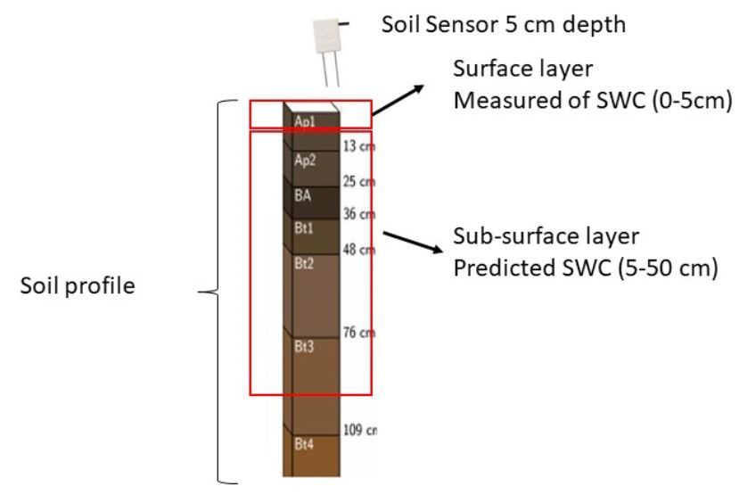
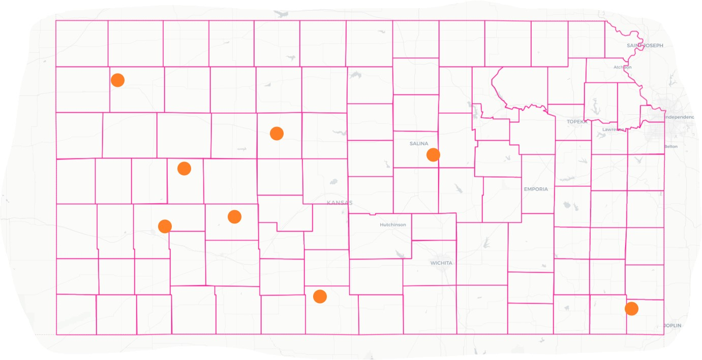
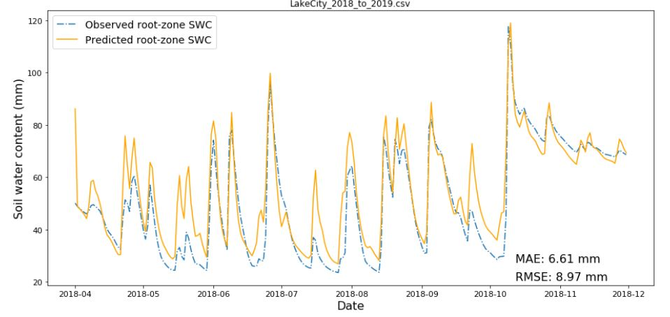
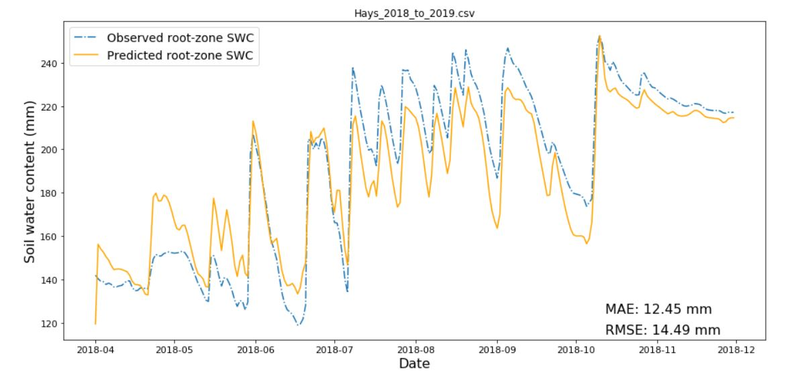

## Estimation of soil water content in the entire root-zone

**Name**: Pedro Rossini  
**Project area**: Agronomy - soil water ralations

## Objective
Implement in python an exponential filter equation to estimate daily soil water content (SWC) of the entire root-zone from daily surface observations.

## Motivation and Methodology

Water stress is considered one of the main limiting factors in summer crop yield. Monitoring SWC of the entire root- zone during the crop seasson is a key factor to improve management irrigation practices and reduce the yield gaps. Solutions like multy depth soil moisture sensors within a field are laborious and expensive for farmers to implemmet.

The exponential filter equation is a known analytical method that is widely used to predict SWC of the root-zone from time series surface soil moisture observations. Briefly, the soil profile is divided in two layers, the surface layer (or first layer) and the sub-surface layer (or second layer), and the equation is used to predict the sub-surface soil moisture from observed measurements at the surface layer (Wagner et al., 1999).  

Albergel et al., (2008) presented a recursive equation to simplify the calculations:

}&space;=&space;SWI_{2(t-1)}&space;&plus;&space;K_t&space;[\text{vwc}_{(t)}&space;-&space;SWI_{2(t-1)}]$$)  

  
where *SWI_2* represents the soil water index of the second layer, *vwc* represents the measured soil moisture at the surface layer, *K* is the gain of the exponential filter ranging between 0 and 1, and *t* is the day of measurement. *SWI_2* is a scaled value based on the minimum and maximum values of each time series and adopt values between 0 and 1.

In order to get the estimated soil water content at the second layer *SWC_2(t)* is necessary to re-scale the *SWI_2* by using the maximum (*W_2 max*) and minimum (*W_2 min*) soil moisture from the second layer as follows:

}&space;=&space;SWI_{2(t)}(W_{2&space;max}&space;-&space;W_{2&space;min})&space;&plus;&space;W_{2&space;min}$$)

Finaly, the entire root-zone SWC (*profileSWC_(t)*) will be obteined by coupling the observed soil moisture at surface (*vwc_(t)*) and the re-scaled *SWC_2(t)* as:

}&space;=&space;SWC_{2(t)}&space;*&space;L2&space;&plus;&space;\text&space;vwc_{(t)}&space;*&space;L1$$)

where L1 and L2 are the thickness of the first and the second soil layers in milimeters.

#### Sketch
 

Figure 1. Sketch summarizing the workflow proposed for this project.

#### Initial parameters

The initial *SWI_2* (t=1) was obtained from a soil moisture observation at 0-5 cm depth at initial time divided by the maximum amount of water that the layer can hold. 

The initial value for *profileSWC* (t=1) was obtained from a soil moisture observation at 0-5 cm depth at initial time multiplied by the length of the first layer (mm) plus the diference between maximum and minimum water holding capacity of the second layer multiply by the length of the second layer (mm).

#### Data used to test the model

For this work, daily soil moisture observations at 5 cm depth (*vwc_(t)*) from Kansas mesonet stations were used as model input to predict profile soil moisture from 0 to 50 cm depth (also called entire root-zone). In addition, soil moisture observations at 10, 20, and 50 cm depth from Kansas mesonet stations were used to test the model output.

The model was tested in eight Mesonet stations during 2018 between April to November (summer crop season), to avoid the interference of freezing temperatures during the winter in soil moisture readings.

#### Kansas mesonet stations and geographic distribution

Eight Mesonet stations across the state were selected taking into consideracion variability of soils types, soil texture, average anual precipitation and land use (rainfed crops, irrigated crops, natural granssland).

  

- Cherokee_2018_to_2019 
- Colby_2018_to_2019
- GardenCity_2018_to_2019       
- Gypsum_2018_to_2019  
- Hays_2018_to_2019
- Hodgeman_2018_to_2019
- LakeCity_2018_to_2019
- Lane_2018_to_2019
 
 
 
Figure 2. Map of the state of Kansas showing the location and distribution of the Mesonet stations (orange dots) selected for this study. 

## Results and Discussion

Soil water content for the entire root-zone (0 to 50 cm) was predicted successfully for all the selected Mesonet stations, showing consistent results and reasonable predictability. Figure 3 shows the result of the model predictions against the observed data for two of the selected stations during the study period. 

 

 
 

Figure 3 - Observed vs predicted *SWC* in millimeterss across time at Lake City (upper) and Hays (bottom) Mesonet stations.

The model was able to accurately predict wet and dry periods across the summer season. However, initial estimations of the profile SWC showed poor concordance with the observed data for all the Mesonet stations. This is expected given that the initial parameters are selected by user guessing. For later estimations (after five days of simulations) the model adjusts, showing a better concordance with the observed values (Figure 3).

For each station, the goodness of fit between observed and predicted (*profile_SWC*) data was evaluated using the root mean squared error (RMSE) and the mean absolute error (MAE) (Table 1). RMSE and MAE oscillated between 8.97 to 23.98 mm and 6.61 to 20.6 mm, respectively showing a stable range of error for the different conditions (soils type, soil texture, wheather, vegetation, etc). Moreover, MAE fell within a 10% error what is acceptable for a very simple model based only on a few parameters. Maximum, minimum and average SWC were different between stations. However, this variation did not have an impact when predicting the profile SWC. 

Table 1 - Root mean squared error (RMSE) and mean absolute error (MAE)  for the eight Mesonet stations using in this study. Maximum, minimum and average soil water content (SWC) are included for comparison between stations. 

|Station  |RMSE|MSE  |SWC_ave|SWC_min|SWC_max|
|:------- |:--:|:---:|:-----:|:-----:|:-----:|
|Hodgeman|16.64|12.59|164|118|219|    
|Lake City|8.97|6.61|54|26|119|
|Lane    |16.32|13.84|179|107|244|
|Hays    |14.49|12.45|184|119|252|
|Cherokee|18.44|14.66|170|89|226|
|Colby   |20.6|18|210|92|239|
|Garden City|15.99|13.25|100|71|157|
|Gypsum  |23.98|20.6|142|104|194|

### Conclusions

- The model successfully estimated the profile soil water content for different scenarios across Kansas for all the Mesonet stations selected. Further improvement could be done using a more representative number of stations.
- The model was able to capture the response for different rainfall events during the season (Supplementary figure 1).
- Overall, RMSE and MAE oscillated between reasonable values, explaining an error between 6 to 12% in the entire soil profile.
- In addition to the eight Mesonet stations presented in this study, the model was used to predict other stations (data not presented). However, the model was not able to accuratelly predict SWC in all the cases. A simple modification in the sub_surf_max, sub_surf_min parameter was done in order to achieve similar predictions to the other stations (data not showed).

### Reproducible research

The data used in this study and an appendix for reproducibility with supplementary material are available to download from https://github.com/prossini1/project

## References
Albergel, C., Rudiger, C., Pellarin, T., Calvet, J.-C., Fritz, N., Frois-sard, F., Suquia, D., Petitpa, A., Piguet, B., and Martin, E.(2008) From near-surface to root-zone soil moisture using an exponential filter: an assessment of the method based on in-situ observations and model simulations, Hydrol. Earth Syst. Sci., 12, 1323–1337,
doi:10.5194/hess-12-1323-2008

Wagner, W., Lemoine, G., & Rott, H. (1999). A method for estimating soil moisture from ERS scatterometer and soil data. Remote sensing of environment, 70(2), 191-207.

