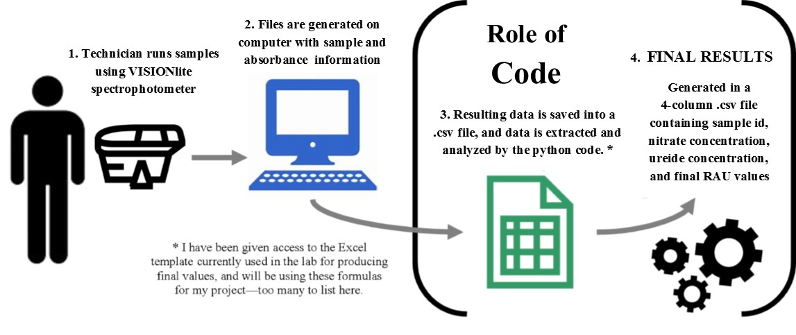

# Automation of Spectrophotometry Data Analysis

**Name**: Rachel Veenstra  
**Semester**: Spring 2019  
**Project Area**: Agronomy

## Objective

Create a Python function to organize and analyze data from absorbance analysis of ureides and nitrates for ease of analysis in the KSU Crops Lab.

## Outcomes

I want this function to produce a .csv file with results for sample analysis of ureide concentration, nitrate concentration, and final RAU% (Relative Abundance of Ureides) using values generated and exported via Excel files to the computer by the spectrophotometer in the lab. Specifics of my code that I want to accomplish are as follows:
- Import .csv files from the KSU Crops dropbox.
- Ask/prompt the user to identify parameters of dry tissue/solvent amounts used.
- Respond accordingly based on the parameters given in the previous answer (i.e. run with expected dilution factor or adjust for differences).
- Within the file, identify what is a standard and what is a sample.
- Recognize that there are two repetitions for each sample, quantify the variance between the two (>10% should throw some sort of error message), and take the mean of samples with acceptable variance.
- Generate a curve based on the intersection of the concentration and absorbance values of the standards, and export for later viewing.
- Plot absorbance means of each sample on the curve to yield final concentration values.
- Export these values (after running separately for ureides and nitrates) to a single file and match based on sample id information.
- There should be four columns on the final .csv file - sample id, ureide concentration, nitrate concentration, and the RAU value.

## Background and Rationale

Ureide and nitrate tests are run by the KSU Crops lab in an effort to identify and quantity possible symbiotic fixation of nitrogen by rhizobia in the rhizosphere of soybeans. Currently, there are Excel sheets for each parameter generated by the machine when samples are run, which contain an identification number and the absorbance value for the sample. These values are automatically saved on a lab computer and then must be manipulated into the correct Excel file to create concentration and curve-fit values based on formulas embedded in the Excel sheet. This is not a huge inconvenience to our lab scientists, but they agree that a code with this function would be beneficial to streamline the process and automate lab analysis procedures.

## Sketch

## References

Herridge, D. F., & Peoples, M. B. (1990). Ureide assay for measuring nitrogen fixation by nodulated soybean calibrated by N methods. Plant physiology, 93(2), 495-503.
