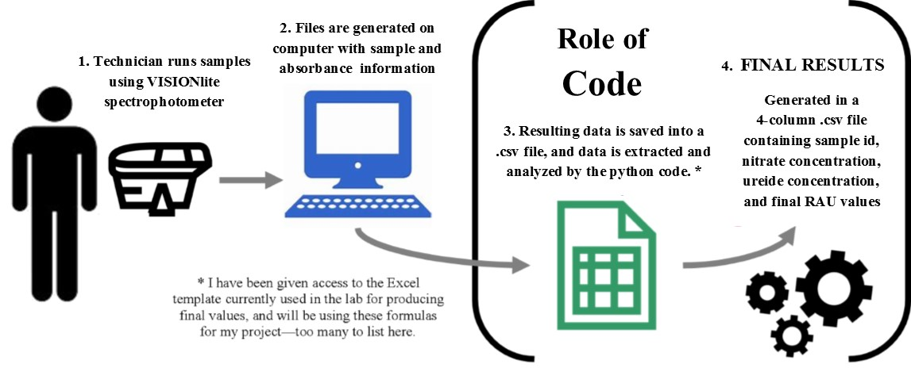

# Automation of Spectrophotometry Data Analysis

**Name**: Rachel Veenstra  
**Semester**: Spring 2019  
**Project Area**: Agronomy

## Project Objective

Create a Python function to organize and analyze data from absorbance analysis of ureides and nitrates for ease of analysis in the KSU Crops Lab.

## General Code Documentation

Purpose:
>Pulling data from ureide and nitrate spectrophotometry sheets and calculating Relative Abundance of Ureides (RAU%) in a given sample based on concentrations of ureides and nitrates for that sample. Concentrations are calculated by extrapolating values based on curve and blank information unique to each data sheet.

Inputs:
>Cloned repository on user's computer - code will automatically navigate to correct folder.

>Correctly formatted datasheets in the "Datasets" directory. 
If user does not want sheets to be re-run in future , save in a new folder in "Datasets" directory.

>Number of files is not important, as long as each sample has a unique ID.

Outputs:
>.csv file with four columns - Sample ID, nitrate concentration (micromoles/gram), ureide concentration (micromoles/gram), and final RAU calculations.

>Data is sorted and matched based on the Sample_ID information.

Author: Rachel Veenstra
Updated: 05-07-2019

## Background and Rationale

Ureide and nitrate tests are run by the KSU Crops lab in an effort to identify and quantify possible symbiotic fixation of nitrogen by rhizobia in the rhizosophere of soybeans. This is done by calulating the RAU% (Relative Abundance of Ureides). Currently, there are Excel sheets for each parameter (ureides and nitrates) generated by the machine when samples are run, which contain an identification number and the absorbance value for the sample. These values are automatically saved on a lab computer and then must be manipulated into the correct Excel file to create concentration and curve-fit values based on formulas embedded in the Excel sheet. This is not a huge inconvenience to our lab technicians, but they agree that a code with this function would be beneficial to streamline the process and automate lab analysis procedures.

## Sketch

## References

Herridge, D. F., & Peoples, M. B. (1990). Ureide assay for measuring nitrogen fixation by nodulated soybean calibrated by N methods. Plant physiology, 93(2), 495-503.
