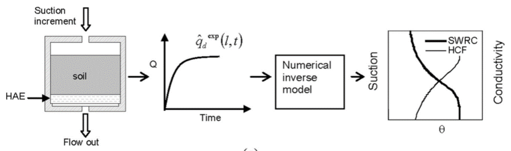

# Transient Water Release and Imbibition Method (TRIM) Data Processing Tool

__Name__: Robert Sherwood 
__Semester__: Spring 2020 
__Project Area__: Geotechnical Engineering

## Background

The K-State Civil Engineering Department is currently conducting research on railroad ballast: characterizing the suction properties of fouled ballast using soil water characteristic curves (SWCC). A transient water release and imbibition method (TRIM, Wayllace and Lu 2012) is in use. The TRIM measures the two-step outflow of an unsaturated sample (such as fouled ballast) and then models the SWCC using an inverse method. The method is illustrated in figure 1. Three to five hours of data processing are typically required for production of premium SWCC models using this method. Processing includes phase relationship calculations, filtering and formatting sample data, updating model input files, inverse modeling methods, extracting and formatting model output, and creating figures of results. Much of this work is being executed in Excel, Note++, Hydrus 1D, and MATLAB. Characterization of fouled ballast will outlast the academic careers of several master's students; therefore, a thoughtfully designed automated process would help productivity throughout the course of the project especially as new students begin to work on it.

Figure 1: Concept of the TRIM test.

## Objective

The objective of this coding project is to automate as much of the processes as possible. It should facilitate faster experimental setup, data processing, modeling, and creation of figures. It should also increase the integrity and repeatability of results by cutting out manually performed steps in each category. This coding project is broken into three phases. Each phase and their respective outcomes are listed below.

### Phase 1
* Accept user input data: specific gravity, sample volume, sample target dry density, and sample degree of fouling.
* Perform phase relationship calculations using that data to get required dry mass of sample, design height of sample, porosity, and saturated volumetric water content.
* Return a .txt file with TRIM test specs for experimental setup, four parameters: Porosity, Density (gr. cm3), Sample Height (cm), and Saturated Volumetric Water Content.

### Phase 2
* Open and read the text file of recorded two-step outflow data produced by the TRIM software.
* Separate saturated flow data from unsaturated flow data in the file.
* Process the unsaturated flow data: sample the data (sample 150 points form the typical 2000 points collected), and calculate the adjust flow data compensating for evaporation and diffused air.
* Return a .txt file of adjusted unsaturated flow data (minimum of 100 data points) formatted as Hydrus 1D model input. Five columns: Date (mm/dd/yyyy), Time (00:00:00 AM/PM), Step, Mass (g), and Uair (kPa).

### Phase 3
* Open the out.txt file of the inverse modeling software: Hydrus 1D.
* Extract the important data from the out.txt file: SWCC data, and the route mean squared error (RMSE) and regression (R^2) data.
* Return a plot of the fitted objective function, SWCC, HCF, and a .csv file of the SWCC data. Two columns: Pressure (kPa), and Volumetric Water Content.

## Sketch of code

Figure 2: Sketch of Phase 1

Figure 3: Sketch of Phase 2

Figure 4: Sketch of Phase 3

## References
Wayllace, A., & Lu, N. (2012). A transient water release and imbibitions method for rapidly measuring wetting and drying soil water retention and hydraulic conductivity functions. Geotechnical Testing Journal, 35(1), 103-117.
