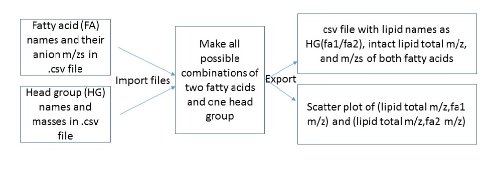

# **Project Proposal:** A start to computational annotation of a lipid mass map 

**Background and Rationale:** Enumeration of plant lipid molecular species and comparison of lipids across the plant kingdom would facilitate identification of the function of genes involved in lipid metabolism and lipid signaling. Recent innovations in the speed of data acquisition by mass spectrometry provide an opportunity to collect and assemble untargeted mass spectral data for systematic, comprehensive lipidome annotation and lipid discovery. The mass spectral data are intensities, each associated with a pair of mass/charge (m/z) values, one for the intact lipid and one for a lipid fragment ion. Some of the fragments represent lipid building blocks, such as fatty acids. Many lipids, for example, glycerolipids, are composed of a finite number of building blocks, arranged in different combinations. Annotation of the mass spectral data could be facilitated by using a computational approach, considering the possible combinations of the lipid components.  
 

**Objective of the code:** The objective of the project is to create a list of some common glycerophospholipid components and combine the components (fatty acids, glycerol-head group pieces) in all ways that are biochemically feasible. The results will be plotted as a scatter plot of intact polar glycerolipid ion m/z vs phosphoglycerolipid fatty acid fragment ion m/z.  The idea is that, in the long-term, the computationally generated scatter plot will be an overlay to a “heat map”-type array of experimental intensity data on an intact ion-fragment m/z grid, providing candidate annotation for the experimentally measured lipids.
 

**Sketch:**  

 

**References:** There are some papers where intact ion masses and fragments are generated, such as these: 
Foster JM, Moreno P, Fabregat A, Hermjakob H, Steinbeck C, et al. (2013) LipidHome: A database of theoretical lipids optimized for high throughput mass spectrometry lipidomics. PLoS ONE 8(5): e61951. doi:10.1371/journal.pone.0061951
 
Witting M, Ruttkies C, Neumann S, Schmitt-Kopplin P (2017) LipidFrag: Improving reliability of in silico fragmentation of lipids and application to the Caenorhabditis elegans lipidome. PLoS ONE 12(3): e0172311. doi:10.1371/journal.pone.0172311